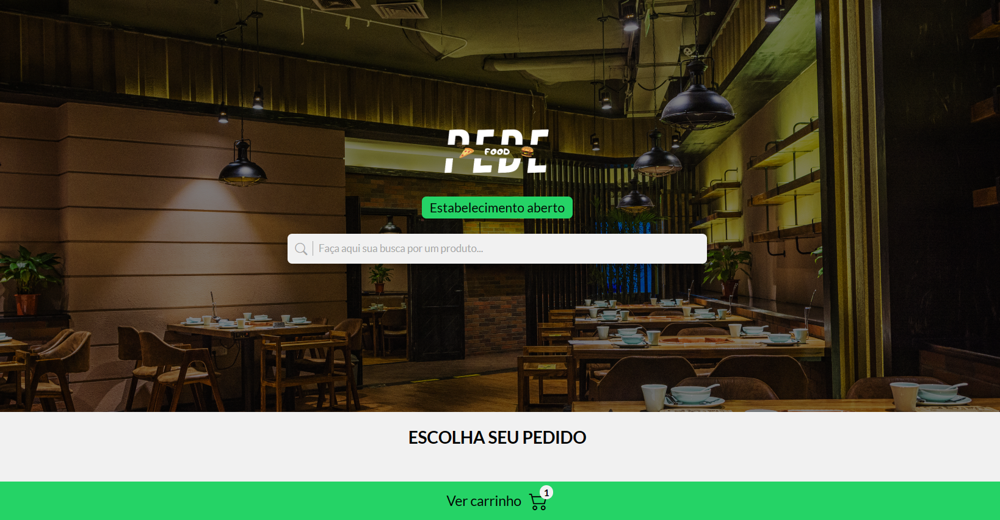

<h1>
Pede Food - Sistema de Pedidos Online 🖥😋
</h1>

## Sobre

O pede foood é um sistema de pedidos online, nele você pode escolher seus produtos, adicioná-los ao carrinho e finalizar o pedido através do **WhatsApp**.

## Ferramentas usadas na sua construção

 

## Funcionalidades do sistema

- Adicionar produtos ao carrinho
- Remover produtos do carrinho
- Buscar por um produto
- Verificar se o estabelecimento está aberto ou fechado
- Verificar se o carrinho está vazio, se sim, aplicar a mensagem de carrinho vazio
- Mostrar a quantidade de produtos existentes no carrinho
- Aplicar a propriedade **disable** no input e no botão de finalizar compra, caso, o carrinho esteja vazio
- Finalizar a compra através do **whatsapp**, usando a api do próprio whatsapp

<a href="#">Clique aqui para ver o projeto</a> ⬅
